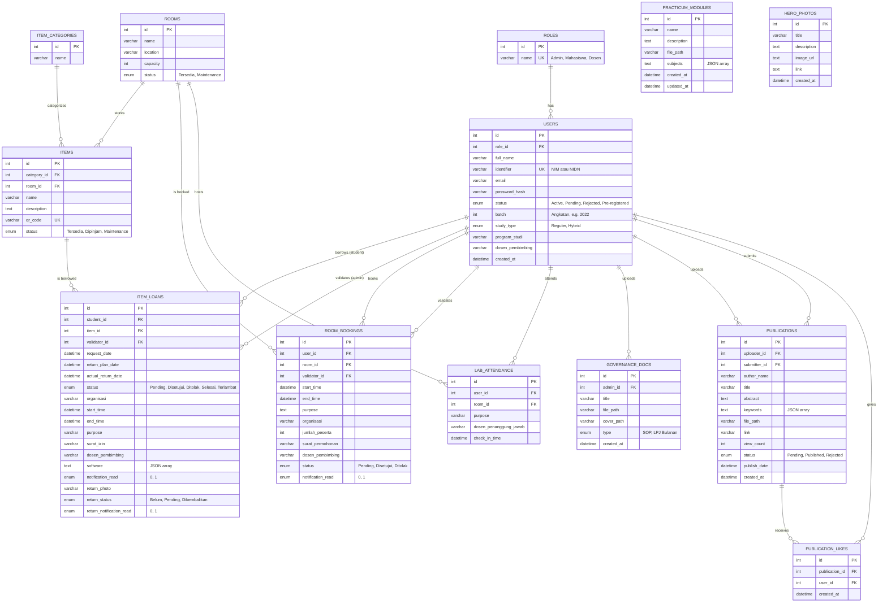
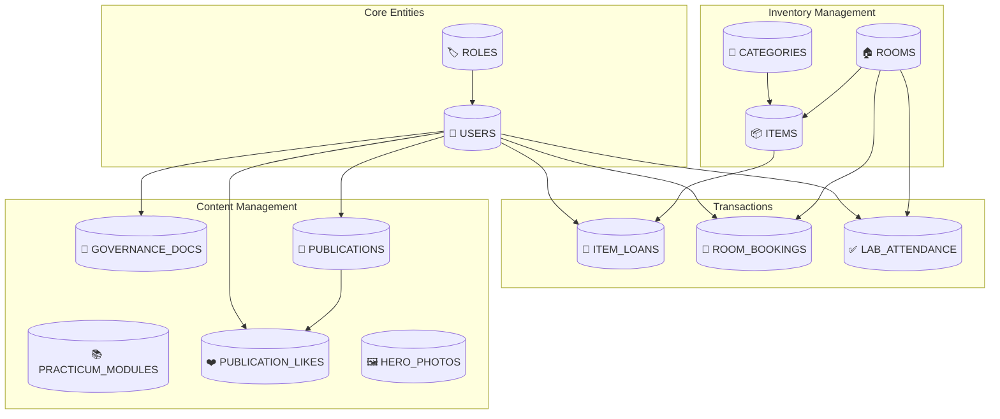
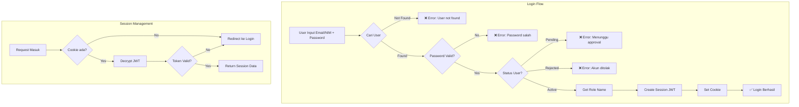
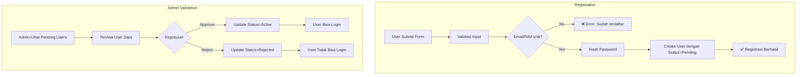
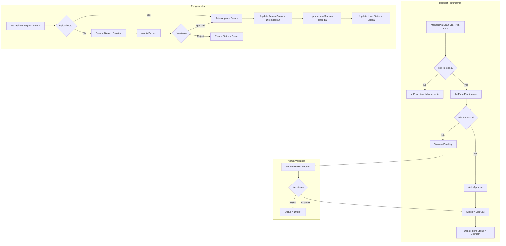
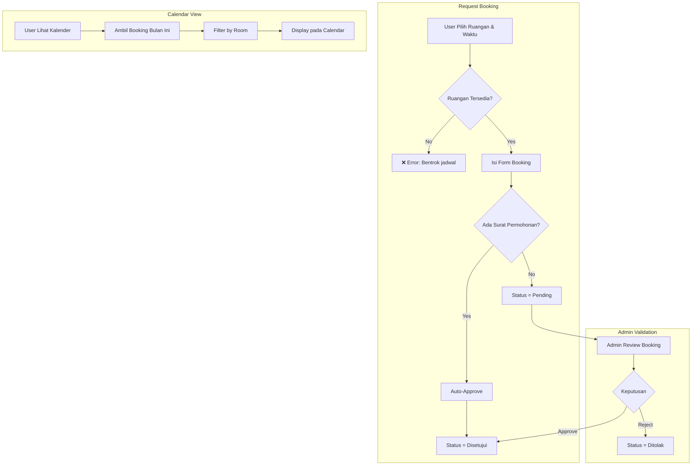
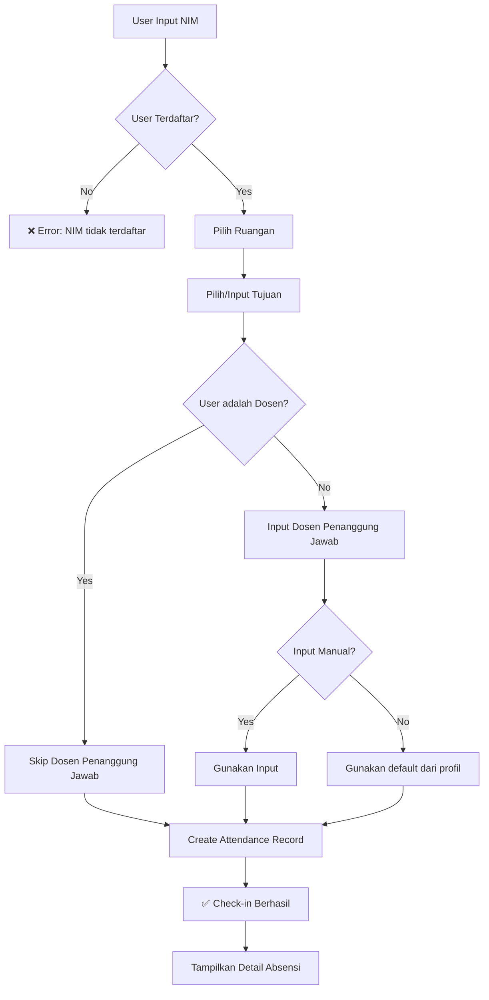
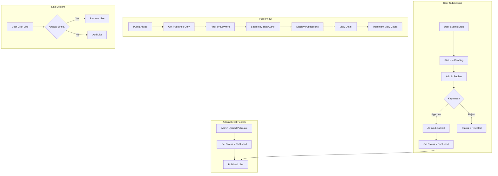
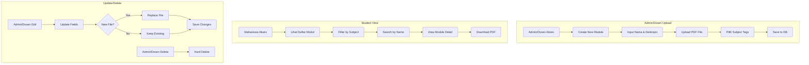
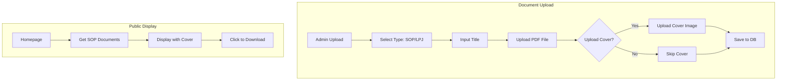

# Backend Documentation

Dokumentasi lengkap backend sistem LAB_UAI, mencakup Entity Relationship Diagram (ERD), relasi antar tabel, dan flowchart untuk setiap fitur utama.

## Entity Relationship Diagram (ERD)

---

## Relasi Antar Tabel

### Ringkasan Relasi

| Tabel Source | Relasi | Tabel Target | Keterangan |
|--------------|--------|--------------|------------|
| `users` | Many-to-One | `roles` | Setiap user memiliki 1 role |
| `items` | Many-to-One | `item_categories` | Setiap item memiliki 1 kategori |
| `items` | Many-to-One | `rooms` | Setiap item disimpan di 1 ruangan |
| `item_loans` | Many-to-One | `users` | Student yang meminjam |
| `item_loans` | Many-to-One | `users` | Admin yang memvalidasi |
| `item_loans` | Many-to-One | `items` | Item yang dipinjam |
| `room_bookings` | Many-to-One | `users` | User yang memesan |
| `room_bookings` | Many-to-One | `users` | Admin yang memvalidasi |
| `room_bookings` | Many-to-One | `rooms` | Ruangan yang dipesan |
| `lab_attendance` | Many-to-One | `users` | User yang check-in |
| `lab_attendance` | Many-to-One | `rooms` | Ruangan yang dimasuki |
| `governance_docs` | Many-to-One | `users` | Admin yang upload |
| `publications` | Many-to-One | `users` | Admin/Dosen yang publish |
| `publications` | Many-to-One | `users` | User yang submit draft |
| `publication_likes` | Many-to-One | `publications` | Publikasi yang di-like |
| `publication_likes` | Many-to-One | `users` | User yang like |

### Diagram Relasi Tingkat Tinggi

---

## Flowchart Fitur

### 1. Authentication Flow

### 2. User Registration & Validation Flow

### 3. Item Loan Flow

### 4. Room Booking Flow

### 5. Lab Attendance Flow

### 6. Publication Flow

### 7. Practicum Module Flow

### 8. Governance Document Flow

---

## API Endpoints (Server Actions)

### Authentication (`features/auth/actions.ts`)

| Action | Deskripsi | Role |
|--------|-----------|------|
| `login(formData)` | Login user | Public |
| `logout()` | Logout user | Authenticated |

### Users (`features/users/actions.ts`)

| Action | Deskripsi | Role |
|--------|-----------|------|
| `getUsers()` | Get all users | Admin |
| `getRoles()` | Get all roles | Admin |
| `getLecturers()` | Get dosen list | Public |
| `createUser(data)` | Create user | Admin |
| `updateUser(id, data)` | Update user | Admin |
| `deleteUser(id)` | Delete user | Admin |
| `getPendingUsers()` | Get pending registrations | Admin |
| `updateUserStatus(id, status)` | Approve/reject user | Admin |
| `updateUserProfile(data)` | Update own profile | Authenticated |

### Inventory (`features/inventory/actions.ts`)

| Action | Deskripsi | Role |
|--------|-----------|------|
| `getRooms()` | Get all rooms | Public |
| `createRoom(data)` | Create room | Admin |
| `updateRoom(id, data)` | Update room | Admin |
| `deleteRoom(id)` | Delete room | Admin |
| `updateRoomStatus(id, status)` | Change room status | Admin |
| `getCategories()` | Get item categories | Public |
| `createCategory(data)` | Create category | Admin |
| `updateCategory(id, data)` | Update category | Admin |
| `deleteCategory(id)` | Delete category | Admin |
| `getItems()` | Get all items | Public |
| `createItem(data)` | Create item | Admin |
| `updateItem(id, data)` | Update item | Admin |
| `deleteItem(id)` | Delete item | Admin |
| `updateItemStatus(id, status)` | Change item status | Admin |
| `getItemByQrCode(qrCode)` | Get item by QR | Public |

### Loans (`features/loans/actions.ts`)

| Action | Deskripsi | Role |
|--------|-----------|------|
| `getAvailableItems(categoryId?)` | Get borrowable items | Public |
| `createLoanRequest(data)` | Request loan | Student |
| `getLoanRequests(status?, dates?)` | Get all loans | Admin |
| `updateLoanStatus(id, status, validatorId)` | Approve/reject loan | Admin |
| `deleteLoan(id)` | Delete loan | Admin |
| `getMyLoans(userId)` | Get user's loans | Authenticated |
| `requestItemReturn(loanId, photo?)` | Request return | Student |
| `approveReturn(loanId, validatorId)` | Approve return | Admin |
| `rejectReturn(loanId)` | Reject return | Admin |
| `getPendingReturns()` | Get pending returns | Admin |

### Bookings (`features/bookings/actions.ts`)

| Action | Deskripsi | Role |
|--------|-----------|------|
| `getAllRooms()` | Get all rooms | Public |
| `getLecturers()` | Get dosen list | Public |
| `getRoomAvailability(roomId, date)` | Check availability | Authenticated |
| `createRoomBooking(data)` | Create booking | Authenticated |
| `getBookingRequests(status?, dates?)` | Get all bookings | Admin |
| `deleteBooking(id)` | Delete booking | Admin |
| `updateBookingStatus(id, status, validatorId)` | Approve/reject | Admin |
| `getMyBookings(userId)` | Get user's bookings | Authenticated |
| `getMonthBookings(month, year)` | Get calendar data | Public |

### Attendance (`features/attendance/actions.ts`)

| Action | Deskripsi | Role |
|--------|-----------|------|
| `getRooms()` | Get available rooms | Public |
| `getLecturers()` | Get dosen list | Public |
| `checkIn(nim, roomId, purpose, dosen?)` | Check-in | Public |
| `getTodayAttendanceAction()` | Get today's attendance | Admin |
| `getRoomAttendanceStatsAction()` | Get stats | Admin |

### Publications (`features/publications/actions.ts`)

| Action | Deskripsi | Role |
|--------|-----------|------|
| `createPublication(data)` | Direct publish | Admin |
| `submitPublication(data)` | Submit for review | Authenticated |
| `approvePublication(id, uploaderId, updates?)` | Approve submission | Admin |
| `rejectPublication(id)` | Reject submission | Admin |
| `updatePublication(id, data)` | Edit publication | Admin/Dosen |
| `getPublicPublications(filters?)` | Get published | Public |
| `getPublications(filters?)` | Get all | Admin |
| `getUserPublications(submitterId)` | Get user's submissions | Authenticated |
| `deletePublication(id)` | Delete publication | Admin |
| `togglePublicationLike(pubId, userId)` | Like/unlike | Authenticated |

### Practicum (`features/practicum/actions.ts`)

| Action | Deskripsi | Role |
|--------|-----------|------|
| `getModules()` | Get all modules | Public |
| `getModuleById(id)` | Get module detail | Public |
| `searchModules(query)` | Search modules | Public |
| `getAllSubjects()` | Get subject tags | Public |
| `createModule(data)` | Create module | Admin/Dosen |
| `updateModule(id, data)` | Update module | Admin/Dosen |
| `deleteModule(id)` | Delete module | Admin/Dosen |

### Governance (`features/governance/actions.ts`)

| Action | Deskripsi | Role |
|--------|-----------|------|
| `getGovernanceDocs(type)` | Get docs by type | Public |
| `uploadGovernanceDoc(formData)` | Upload document | Admin |
| `updateGovernanceDoc(id, formData)` | Update document | Admin |
| `deleteGovernanceDoc(id)` | Delete document | Admin |

---

## Status Enums

### User Status
- `Pending` - Menunggu approval admin
- `Active` - Akun aktif
- `Rejected` - Ditolak admin
- `Pre-registered` - Bulk import (belum set password)

### Item Status
- `Tersedia` - Bisa dipinjam
- `Dipinjam` - Sedang dipinjam
- `Maintenance` - Tidak tersedia

### Room Status
- `Tersedia` - Bisa dipesan
- `Maintenance` - Tidak tersedia

### Loan Status
- `Pending` - Menunggu approval
- `Disetujui` - Disetujui, sedang dipinjam
- `Ditolak` - Ditolak admin
- `Selesai` - Sudah dikembalikan
- `Terlambat` - Lewat batas waktu

### Loan Return Status
- `Belum` - Belum request return
- `Pending` - Menunggu approval return
- `Dikembalikan` - Sudah dikembalikan

### Booking Status
- `Pending` - Menunggu approval
- `Disetujui` - Booking confirmed
- `Ditolak` - Ditolak admin

### Publication Status
- `Pending` - Draft menunggu review
- `Published` - Sudah dipublish
- `Rejected` - Ditolak

---

## Database Indexes

| Tabel | Index | Kolom |
|-------|-------|-------|
| `users` | `role_idx` | `role_id` |
| `users` | `batch_idx` | `batch` |
| `items` | `category_idx` | `category_id` |
| `items` | `room_idx` | `room_id` |
| `item_loans` | `student_idx` | `student_id` |
| `item_loans` | `item_idx` | `item_id` |
| `item_loans` | `validator_idx` | `validator_id` |
| `room_bookings` | `user_idx` | `user_id` |
| `room_bookings` | `room_idx` | `room_id` |
| `room_bookings` | `validator_idx` | `validator_id` |
| `lab_attendance` | `user_idx` | `user_id` |
| `lab_attendance` | `room_idx` | `room_id` |
| `lab_attendance` | `check_in_time_idx` | `check_in_time` |
| `governance_docs` | `admin_idx` | `admin_id` |
| `publications` | `uploader_idx` | `uploader_id` |
| `publications` | `submitter_idx` | `submitter_id` |
| `publications` | `status_idx` | `status` |
| `publication_likes` | `publication_idx` | `publication_id` |
| `publication_likes` | `user_idx` | `user_id` |
| `publication_likes` | `unique_like` | `publication_id, user_id` |

---

## File Locations

| Domain | Schema File | Actions File | Service File |
|--------|-------------|--------------|--------------|
| Users | `db/schema/users.ts` | `features/users/actions.ts` | `features/users/service.ts` |
| Inventory | `db/schema/inventory.ts` | `features/inventory/actions.ts` | `features/inventory/service.ts` |
| Bookings | `db/schema/bookings.ts` | `features/bookings/actions.ts` | `features/bookings/service.ts` |
| Loans | `db/schema/inventory.ts` | `features/loans/actions.ts` | `features/loans/service.ts` |
| Attendance | `db/schema/attendance.ts` | `features/attendance/actions.ts` | `features/attendance/service.ts` |
| Practicum | `db/schema/practicum.ts` | `features/practicum/actions.ts` | `features/practicum/service.ts` |
| Governance | `db/schema/others.ts` | `features/governance/actions.ts` | - |
| Publications | `db/schema/others.ts` | `features/publications/actions.ts` | `features/publications/service.ts` |
| Hero Photos | `db/schema/others.ts` | `features/hero-photos/actions.ts` | `features/hero-photos/service.ts` |
| Auth | `db/schema/users.ts` | `features/auth/actions.ts` | - |
