# Backend Documentation

Dokumentasi lengkap backend sistem LAB_UAI, mencakup Entity Relationship Diagram (ERD), relasi antar tabel, dan flowchart untuk setiap fitur utama.

## Entity Relationship Diagram (ERD)
### ERD - Entitas dan Relasi

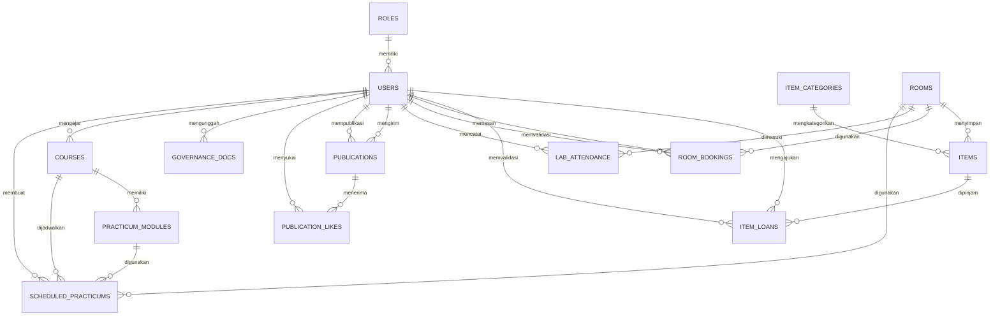

---

### Detail Entitas

#### 1. ROLES

| Kolom | Tipe | Keterangan |
|-------|------|------------|
| id | int | Primary Key |
| name | varchar(50) | Nama role (Admin, Mahasiswa, Dosen) |

---

#### 2. USERS

| Kolom | Tipe | Keterangan |
|-------|------|------------|
| id | int | Primary Key |
| role_id | int | FK → ROLES |
| full_name | varchar(255) | Nama lengkap |
| identifier | varchar(50) | NIM/NIDN (Unique) |
| email | varchar(255) | Email |
| password_hash | varchar(255) | Password hash |
| status | enum | Active, Pending, Rejected, Pre-registered |
| batch | int | Angkatan (e.g. 2022) |
| study_type | enum | Reguler, Hybrid |
| program_studi | varchar(100) | Program studi |
| dosen_pembimbing | varchar(255) | Nama dosen pembimbing |
| created_at | datetime | Waktu dibuat |

---

#### 3. ROOMS

| Kolom | Tipe | Keterangan |
|-------|------|------------|
| id | int | Primary Key |
| name | varchar(100) | Nama ruangan |
| location | varchar(255) | Lokasi |
| capacity | int | Kapasitas |
| status | enum | Tersedia, Maintenance |

---

#### 4. ITEM_CATEGORIES

| Kolom | Tipe | Keterangan |
|-------|------|------------|
| id | int | Primary Key |
| name | varchar(100) | Nama kategori |

---

#### 5. ITEMS

| Kolom | Tipe | Keterangan |
|-------|------|------------|
| id | int | Primary Key |
| category_id | int | FK → ITEM_CATEGORIES |
| room_id | int | FK → ROOMS |
| name | varchar(255) | Nama item |
| description | text | Deskripsi |
| qr_code | varchar(255) | QR Code (Unique) |
| status | enum | Tersedia, Dipinjam, Maintenance |

---

#### 6. ITEM_LOANS

| Kolom | Tipe | Keterangan |
|-------|------|------------|
| id | int | Primary Key |
| student_id | int | FK → USERS (peminjam) |
| item_id | int | FK → ITEMS |
| validator_id | int | FK → USERS (admin) |
| request_date | datetime | Tanggal request |
| return_plan_date | datetime | Rencana pengembalian |
| actual_return_date | datetime | Tanggal pengembalian aktual |
| status | enum | Pending, Disetujui, Ditolak, Selesai, Terlambat |
| organisasi | varchar(255) | Organisasi peminjam |
| start_time | datetime | Waktu mulai penggunaan |
| end_time | datetime | Waktu selesai penggunaan |
| purpose | varchar(255) | Tujuan peminjaman |
| surat_izin | varchar(255) | Path surat izin (PDF) |
| dosen_pembimbing | varchar(255) | Nama dosen pembimbing |
| software | text | Software yang dibutuhkan (JSON array) |
| notification_read | enum | '0', '1' — notifikasi auto-approve dibaca admin |
| return_photo | varchar(255) | Foto bukti pengembalian |
| return_status | enum | Belum, Pending, Dikembalikan |
| return_notification_read | enum | '0', '1' — notifikasi auto-return dibaca admin |

---

#### 7. ROOM_BOOKINGS

| Kolom | Tipe | Keterangan |
|-------|------|------------|
| id | int | Primary Key |
| user_id | int | FK → USERS (pemesan) |
| room_id | int | FK → ROOMS |
| validator_id | int | FK → USERS (admin) |
| start_time | datetime | Waktu mulai |
| end_time | datetime | Waktu selesai |
| purpose | text | Tujuan penggunaan |
| organisasi | varchar(255) | Organisasi |
| jumlah_peserta | int | Jumlah peserta |
| surat_permohonan | varchar(255) | Path surat permohonan (PDF) |
| dosen_pembimbing | varchar(255) | Nama dosen pembimbing |
| status | enum | Pending, Disetujui, Ditolak |
| notification_read | enum | '0', '1' — notifikasi auto-approve dibaca admin |

---

#### 8. LAB_ATTENDANCE

| Kolom | Tipe | Keterangan |
|-------|------|------------|
| id | int | Primary Key |
| user_id | int | FK → USERS |
| room_id | int | FK → ROOMS |
| purpose | varchar(255) | Tujuan kegiatan |
| dosen_penanggung_jawab | varchar(255) | Nama dosen |
| check_in_time | datetime | Waktu check-in |

---

#### 9. PUBLICATIONS

| Kolom | Tipe | Keterangan |
|-------|------|------------|
| id | int | Primary Key |
| uploader_id | int | FK → USERS (publisher) |
| submitter_id | int | FK → USERS (submitter) |
| author_name | varchar(255) | Nama penulis |
| title | varchar(255) | Judul publikasi |
| abstract | text | Abstrak |
| keywords | text | Keywords (JSON array) |
| file_path | varchar(255) | Path file |
| link | varchar(255) | External link |
| view_count | int | Jumlah view |
| status | enum | Pending, Published, Rejected |
| publish_date | datetime | Tanggal publish |
| created_at | datetime | Waktu dibuat |

---

#### 10. PUBLICATION_LIKES

| Kolom | Tipe | Keterangan |
|-------|------|------------|
| id | int | Primary Key |
| publication_id | int | FK → PUBLICATIONS |
| user_id | int | FK → USERS |
| created_at | datetime | Waktu like |

---

#### 11. GOVERNANCE_DOCS

| Kolom | Tipe | Keterangan |
|-------|------|------------|
| id | int | Primary Key |
| admin_id | int | FK → USERS |
| title | varchar(255) | Judul dokumen |
| file_path | varchar(255) | Path file |
| cover_path | varchar(255) | Path cover image |
| type | enum | SOP, LPJ Bulanan |
| created_at | datetime | Waktu dibuat |

---

#### 12. COURSES

| Kolom | Tipe | Keterangan |
|-------|------|------------|
| id | int | Primary Key |
| code | varchar(20) | Kode mata kuliah (Unique, e.g. "IF201") |
| name | varchar(255) | Nama mata kuliah (e.g. "Basis Data") |
| description | text | Deskripsi |
| sks | int | Jumlah SKS (default: 3) |
| semester | varchar(50) | Semester (e.g. "Ganjil 2024/2025") |
| lecturer_id | int | FK → USERS (dosen pengajar) |
| created_at | datetime | Waktu dibuat |

---

#### 13. PRACTICUM_MODULES

| Kolom | Tipe | Keterangan |
|-------|------|------------|
| id | int | Primary Key |
| course_id | int | FK → COURSES |
| name | varchar(255) | Nama modul |
| description | text | Deskripsi |
| file_path | varchar(255) | Path file PDF |
| created_at | datetime | Waktu dibuat |
| updated_at | datetime | Waktu update |

---

#### 14. SCHEDULED_PRACTICUMS

| Kolom | Tipe | Keterangan |
|-------|------|------------|
| id | int | Primary Key |
| course_id | int | FK → COURSES |
| room_id | int | FK → ROOMS |
| module_id | int | FK → PRACTICUM_MODULES |
| created_by | int | FK → USERS (pembuat jadwal) |
| semester | varchar(50) | Semester (e.g. "Ganjil 2024/2025") |
| day_of_week | int | Hari (0=Senin, 1=Selasa, ..., 6=Minggu) |
| start_time | varchar(5) | Jam mulai (e.g. "08:00") |
| end_time | varchar(5) | Jam selesai (e.g. "10:00") |
| scheduled_date | datetime | Tanggal praktikum |
| status | enum | Aktif, Dibatalkan |
| created_at | datetime | Waktu dibuat |

---

#### 15. HERO_PHOTOS

| Kolom | Tipe | Keterangan |
|-------|------|------------|
| id | int | Primary Key |
| title | varchar(255) | Judul foto |
| description | text | Deskripsi |
| image_url | text | URL gambar |
| link | text | Link tujuan |
| created_at | datetime | Waktu dibuat |

---

## Relasi Antar Tabel

### Ringkasan Relasi

| Tabel Source | Relasi | Tabel Target | Keterangan |
|--------------|--------|--------------|------------|
| `users` | Many-to-One | `roles` | Setiap user memiliki 1 role |
| `items` | Many-to-One | `item_categories` | Setiap item memiliki 1 kategori |
| `items` | Many-to-One | `rooms` | Setiap item disimpan di 1 ruangan |
| `item_loans` | Many-to-One | `users` | Student yang meminjam |
| `item_loans` | Many-to-One | `users` | Admin yang memvalidasi |
| `item_loans` | Many-to-One | `items` | Item yang dipinjam |
| `room_bookings` | Many-to-One | `users` | User yang memesan |
| `room_bookings` | Many-to-One | `users` | Admin yang memvalidasi |
| `room_bookings` | Many-to-One | `rooms` | Ruangan yang dipesan |
| `lab_attendance` | Many-to-One | `users` | User yang check-in |
| `lab_attendance` | Many-to-One | `rooms` | Ruangan yang dimasuki |
| `governance_docs` | Many-to-One | `users` | Admin yang upload |
| `publications` | Many-to-One | `users` | Admin/Dosen yang publish |
| `publications` | Many-to-One | `users` | User yang submit draft |
| `publication_likes` | Many-to-One | `publications` | Publikasi yang di-like |
| `publication_likes` | Many-to-One | `users` | User yang like |
| `courses` | Many-to-One | `users` | Dosen pengajar |
| `practicum_modules` | Many-to-One | `courses` | Modul milik mata kuliah |
| `scheduled_practicums` | Many-to-One | `courses` | Jadwal untuk mata kuliah |
| `scheduled_practicums` | Many-to-One | `rooms` | Ruangan yang digunakan |
| `scheduled_practicums` | Many-to-One | `practicum_modules` | Modul yang dijalankan |
| `scheduled_practicums` | Many-to-One | `users` | User pembuat jadwal |

### Diagram Relasi Tingkat Tinggi

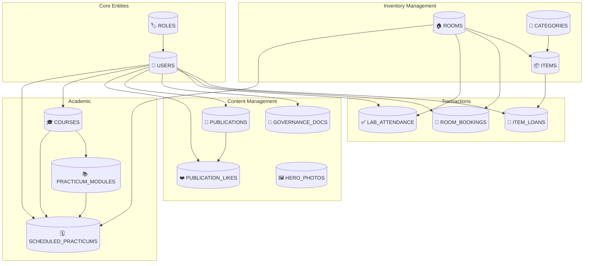

---

## Flowchart Fitur

Flowchart dibagi per proses agar lebih compact dan mudah di-screenshot.

---

### 1. Login Flow

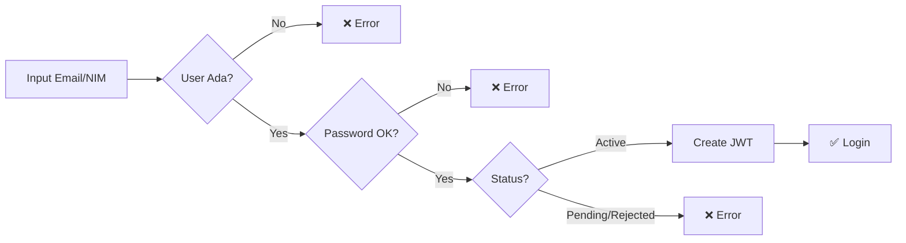

---

### 2. Session Check Flow

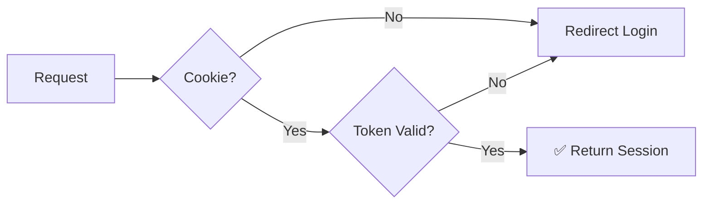

---

### 3. User Registration Flow

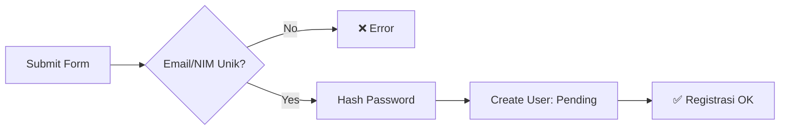

---

### 4. User Validation Flow (Admin)

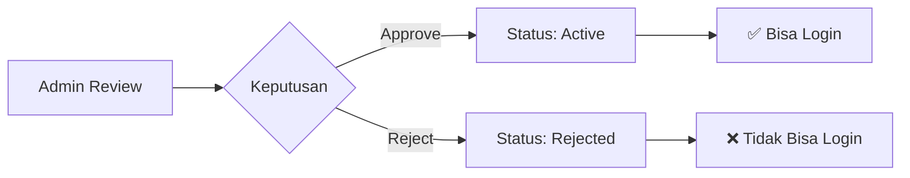

---

### 5. Item Loan Request Flow

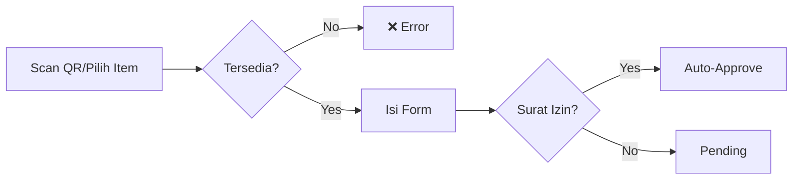

---

### 6. Item Loan Approval Flow

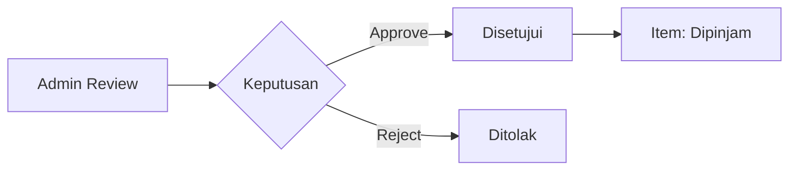

---

### 7. Item Return Flow

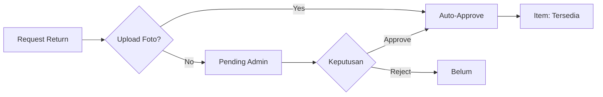

---

### 8. Room Booking Request Flow

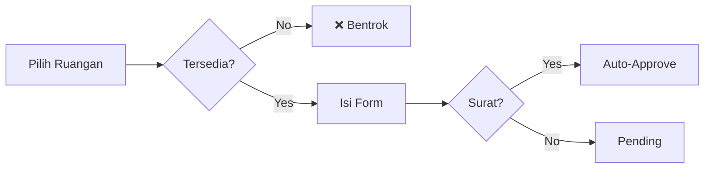

---

### 9. Room Booking Approval Flow

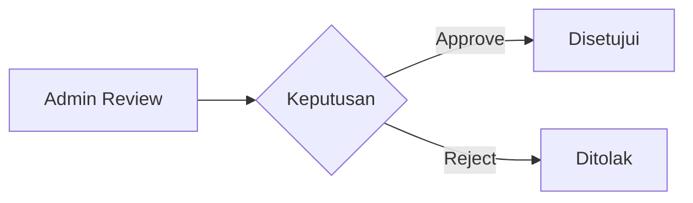

---

### 10. Lab Attendance Flow

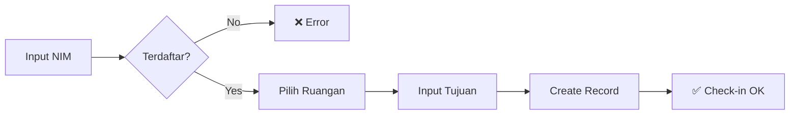

---

### 11. Publication Submit Flow

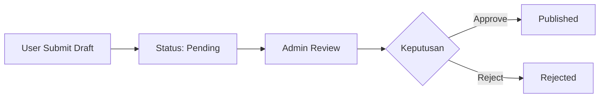

---

### 12. Publication Direct Publish (Admin)

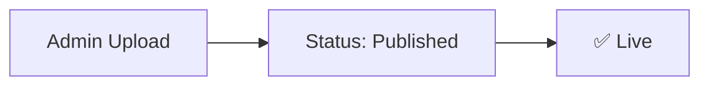

---

### 13. Publication Like Flow

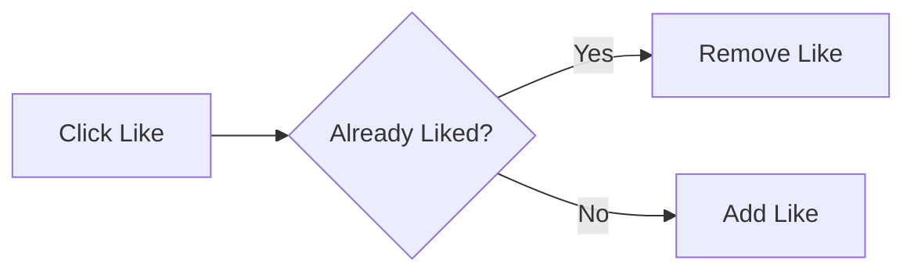

---

### 14. Practicum Module Upload Flow

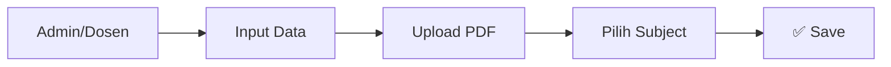

---

### 15. Practicum Module View Flow

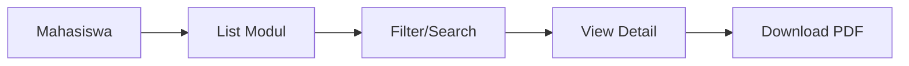

---

### 16. Governance Doc Upload Flow

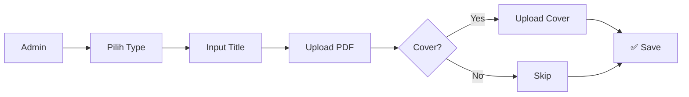

---

## API Endpoints (Server Actions)

### Authentication (`features/auth/actions.ts`)

| Action | Deskripsi | Role |
|--------|-----------|------|
| `login(formData)` | Login user | Public |
| `logout()` | Logout user | Authenticated |

### Users (`features/users/actions.ts`)

| Action | Deskripsi | Role |
|--------|-----------|------|
| `getUsers()` | Get all users | Admin |
| `getRoles()` | Get all roles | Admin |
| `getLecturers()` | Get dosen list | Public |
| `createUser(data)` | Create user | Admin |
| `updateUser(id, data)` | Update user | Admin |
| `deleteUser(id)` | Delete user | Admin |
| `getPendingUsers()` | Get pending registrations | Admin |
| `updateUserStatus(id, status)` | Approve/reject user | Admin |
| `updateUserProfile(data)` | Update own profile | Authenticated |

### Inventory (`features/inventory/actions.ts`)

| Action | Deskripsi | Role |
|--------|-----------|------|
| `getRooms()` | Get all rooms | Public |
| `createRoom(data)` | Create room | Admin |
| `updateRoom(id, data)` | Update room | Admin |
| `deleteRoom(id)` | Delete room | Admin |
| `updateRoomStatus(id, status)` | Change room status | Admin |
| `getCategories()` | Get item categories | Public |
| `createCategory(data)` | Create category | Admin |
| `updateCategory(id, data)` | Update category | Admin |
| `deleteCategory(id)` | Delete category | Admin |
| `getItems()` | Get all items | Public |
| `createItem(data)` | Create item | Admin |
| `updateItem(id, data)` | Update item | Admin |
| `deleteItem(id)` | Delete item | Admin |
| `updateItemStatus(id, status)` | Change item status | Admin |
| `getItemByQrCode(qrCode)` | Get item by QR | Public |

### Loans (`features/loans/actions.ts`)

| Action | Deskripsi | Role |
|--------|-----------|------|
| `getAvailableItems(categoryId?)` | Get borrowable items | Public |
| `createLoanRequest(data)` | Request loan | Student |
| `getLoanRequests(status?, dates?)` | Get all loans | Admin |
| `updateLoanStatus(id, status, validatorId)` | Approve/reject loan | Admin |
| `deleteLoan(id)` | Delete loan | Admin |
| `getMyLoans(userId)` | Get user's loans | Authenticated |
| `requestItemReturn(loanId, photo?)` | Request return | Student |
| `approveReturn(loanId, validatorId)` | Approve return | Admin |
| `rejectReturn(loanId)` | Reject return | Admin |
| `getPendingReturns()` | Get pending returns | Admin |

### Bookings (`features/bookings/actions.ts`)

| Action | Deskripsi | Role |
|--------|-----------|------|
| `getAllRooms()` | Get all rooms | Public |
| `getLecturers()` | Get dosen list | Public |
| `getRoomAvailability(roomId, date)` | Check availability | Authenticated |
| `createRoomBooking(data)` | Create booking | Authenticated |
| `getBookingRequests(status?, dates?)` | Get all bookings | Admin |
| `deleteBooking(id)` | Delete booking | Admin |
| `updateBookingStatus(id, status, validatorId)` | Approve/reject | Admin |
| `getMyBookings(userId)` | Get user's bookings | Authenticated |
| `getMonthBookings(month, year)` | Get calendar data | Public |

### Attendance (`features/attendance/actions.ts`)

| Action | Deskripsi | Role |
|--------|-----------|------|
| `getRooms()` | Get available rooms | Public |
| `getLecturers()` | Get dosen list | Public |
| `checkIn(nim, roomId, purpose, dosen?)` | Check-in | Public |
| `getTodayAttendanceAction()` | Get today's attendance | Admin |
| `getRoomAttendanceStatsAction()` | Get stats | Admin |

### Publications (`features/publications/actions.ts`)

| Action | Deskripsi | Role |
|--------|-----------|------|
| `createPublication(data)` | Direct publish | Admin |
| `submitPublication(data)` | Submit for review | Authenticated |
| `approvePublication(id, uploaderId, updates?)` | Approve submission | Admin |
| `rejectPublication(id)` | Reject submission | Admin |
| `updatePublication(id, data)` | Edit publication | Admin/Dosen |
| `getPublicPublications(filters?)` | Get published | Public |
| `getPublications(filters?)` | Get all | Admin |
| `getUserPublications(submitterId)` | Get user's submissions | Authenticated |
| `deletePublication(id)` | Delete publication | Admin |
| `togglePublicationLike(pubId, userId)` | Like/unlike | Authenticated |

### Practicum (`features/practicum/actions.ts`)

| Action | Deskripsi | Role |
|--------|-----------|------|
| `getModules()` | Get all modules | Public |
| `getModuleById(id)` | Get module detail | Public |
| `searchModules(query)` | Search modules | Public |
| `getAllSubjects()` | Get subject tags | Public |
| `createModule(data)` | Create module | Admin/Dosen |
| `updateModule(id, data)` | Update module | Admin/Dosen |
| `deleteModule(id)` | Delete module | Admin/Dosen |

### Governance (`features/governance/actions.ts`)

| Action | Deskripsi | Role |
|--------|-----------|------|
| `getGovernanceDocs(type)` | Get docs by type | Public |
| `uploadGovernanceDoc(formData)` | Upload document | Admin |
| `updateGovernanceDoc(id, formData)` | Update document | Admin |
| `deleteGovernanceDoc(id)` | Delete document | Admin |

---

## Status Enums

### User Status
- `Pending` - Menunggu approval admin
- `Active` - Akun aktif
- `Rejected` - Ditolak admin
- `Pre-registered` - Bulk import (belum set password)

### Item Status
- `Tersedia` - Bisa dipinjam
- `Dipinjam` - Sedang dipinjam
- `Maintenance` - Tidak tersedia

### Room Status
- `Tersedia` - Bisa dipesan
- `Maintenance` - Tidak tersedia

### Loan Status
- `Pending` - Menunggu approval
- `Disetujui` - Disetujui, sedang dipinjam
- `Ditolak` - Ditolak admin
- `Selesai` - Sudah dikembalikan
- `Terlambat` - Lewat batas waktu

### Loan Return Status
- `Belum` - Belum request return
- `Pending` - Menunggu approval return
- `Dikembalikan` - Sudah dikembalikan

### Booking Status
- `Pending` - Menunggu approval
- `Disetujui` - Booking confirmed
- `Ditolak` - Ditolak admin

### Publication Status
- `Pending` - Draft menunggu review
- `Published` - Sudah dipublish
- `Rejected` - Ditolak

---

## Database Indexes

| Tabel | Index | Kolom |
|-------|-------|-------|
| `users` | `role_idx` | `role_id` |
| `users` | `batch_idx` | `batch` |
| `items` | `category_idx` | `category_id` |
| `items` | `room_idx` | `room_id` |
| `item_loans` | `student_idx` | `student_id` |
| `item_loans` | `item_idx` | `item_id` |
| `item_loans` | `validator_idx` | `validator_id` |
| `room_bookings` | `user_idx` | `user_id` |
| `room_bookings` | `room_idx` | `room_id` |
| `room_bookings` | `validator_idx` | `validator_id` |
| `lab_attendance` | `user_idx` | `user_id` |
| `lab_attendance` | `room_idx` | `room_id` |
| `lab_attendance` | `check_in_time_idx` | `check_in_time` |
| `governance_docs` | `admin_idx` | `admin_id` |
| `publications` | `uploader_idx` | `uploader_id` |
| `publications` | `submitter_idx` | `submitter_id` |
| `publications` | `status_idx` | `status` |
| `publication_likes` | `publication_idx` | `publication_id` |
| `publication_likes` | `user_idx` | `user_id` |
| `publication_likes` | `unique_like` | `publication_id, user_id` |
| `courses` | `lecturer_idx` | `lecturer_id` |
| `practicum_modules` | `course_idx` | `course_id` |
| `scheduled_practicums` | `sp_course_idx` | `course_id` |
| `scheduled_practicums` | `sp_room_idx` | `room_id` |
| `scheduled_practicums` | `sp_module_idx` | `module_id` |
| `scheduled_practicums` | `sp_created_by_idx` | `created_by` |
| `scheduled_practicums` | `sp_semester_idx` | `semester` |

---

## File Locations

| Domain | Schema File | Actions File | Service File |
|--------|-------------|--------------|--------------|
| Users | `db/schema/users.ts` | `features/users/actions.ts` | `features/users/service.ts` |
| Inventory | `db/schema/inventory.ts` | `features/inventory/actions.ts` | `features/inventory/service.ts` |
| Bookings | `db/schema/bookings.ts` | `features/bookings/actions.ts` | `features/bookings/service.ts` |
| Loans | `db/schema/inventory.ts` | `features/loans/actions.ts` | `features/loans/service.ts` |
| Attendance | `db/schema/attendance.ts` | `features/attendance/actions.ts` | `features/attendance/service.ts` |
| Courses | `db/schema/practicum.ts` | `features/courses/actions.ts` | `features/courses/service.ts` |
| Practicum Modules | `db/schema/practicum.ts` | `features/practicum/actions.ts` | `features/practicum/service.ts` |
| Scheduled Practicums | `db/schema/practicum.ts` | `features/scheduled-practicum/actions.ts` | `features/scheduled-practicum/service.ts` |
| Governance | `db/schema/others.ts` | `features/governance/actions.ts` | - |
| Publications | `db/schema/others.ts` | `features/publications/actions.ts` | `features/publications/service.ts` |
| Hero Photos | `db/schema/others.ts` | `features/hero-photos/actions.ts` | `features/hero-photos/service.ts` |
| Auth | `db/schema/users.ts` | `features/auth/actions.ts` | - |
