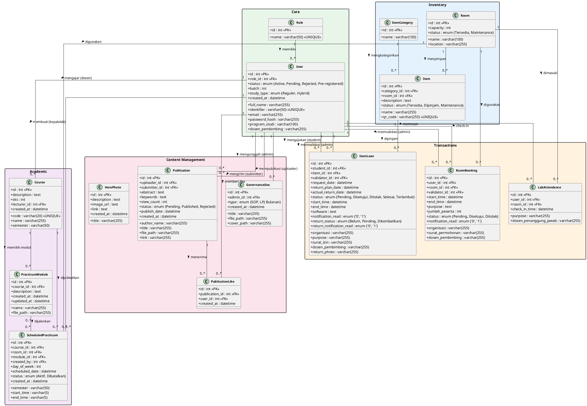
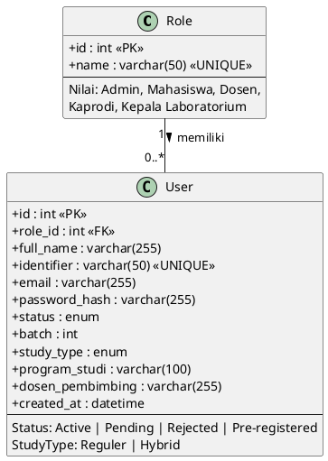
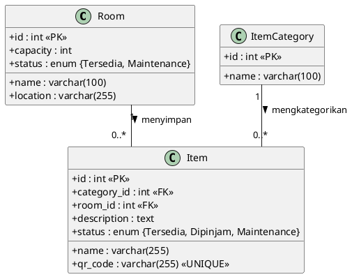
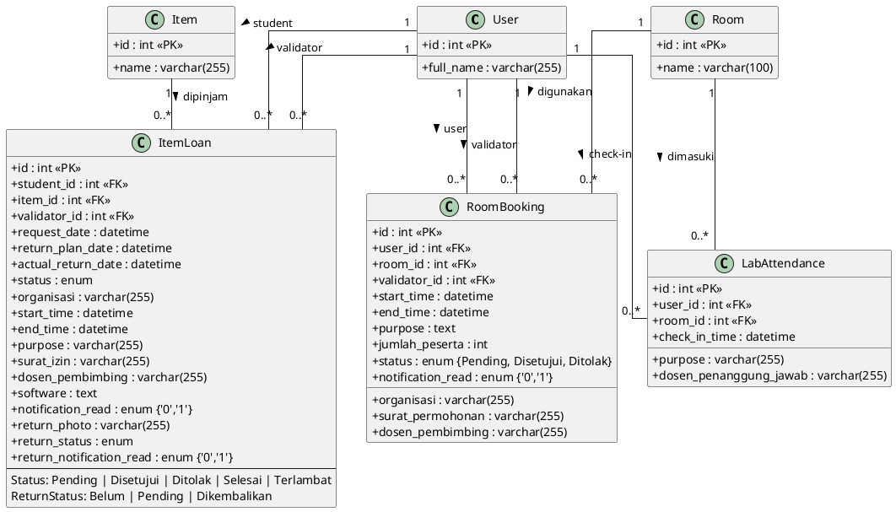
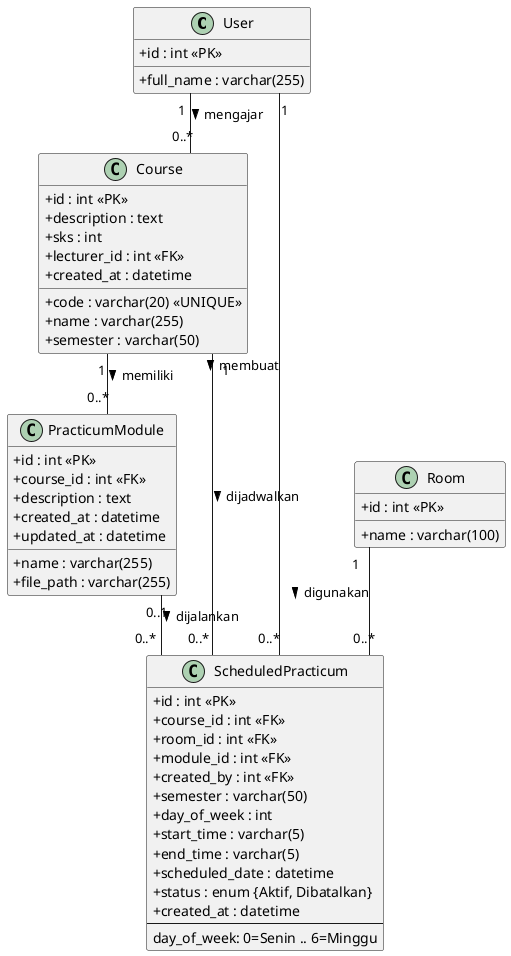
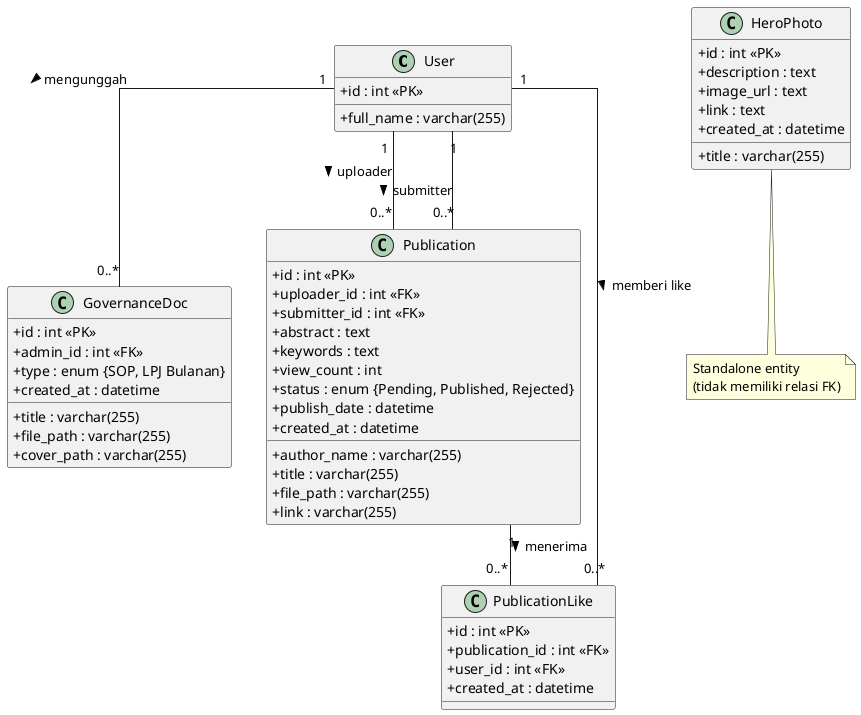

# Class Diagram — Sistem Manajemen Laboratorium UAI

Dokumentasi class diagram menggunakan PlantUML untuk menggambarkan struktur entitas, atribut, dan relasi antar kelas dalam sistem.

---

## Class Diagram Lengkap (Semua Entitas)



---

## Class Diagram per Domain

Diagram dipecah per domain agar lebih mudah dibaca dan di-screenshot.

### 1. Core — Users & Roles



### 2. Inventory — Items, Categories & Rooms



### 3. Transactions — Loans, Bookings & Attendance



### 4. Academic — Courses, Modules & Schedules



### 5. Content Management — Publications, Governance & Hero



---

## Cara Render PlantUML

### Online
1. Buka [PlantUML Online Server](https://www.plantuml.com/plantuml/uml/)
2. Copy-paste kode PlantUML di atas
3. Klik "Submit" untuk render diagram

### VS Code Extension
1. Install extension **PlantUML** (`jebbs.plantuml`)
2. Buka file `.puml` atau blok `plantuml` dalam markdown
3. `Alt+D` untuk preview diagram

### Command Line
```bash
# Install PlantUML
# Membutuhkan Java Runtime
java -jar plantuml.jar CLASS_DIAGRAM.md
```
