# Data Flow Diagram (DFD)

Dokumentasi DFD untuk sistem Laboratorium Informatika UAI.

---

## 🔴 SISTEM LAMA (Manual/Spreadsheet)

### DFD Level 0 - Context Diagram (Sistem Lama)

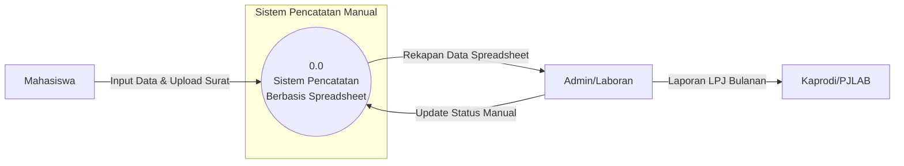

### DFD Level 1 - Process Breakdown (Sistem Lama)

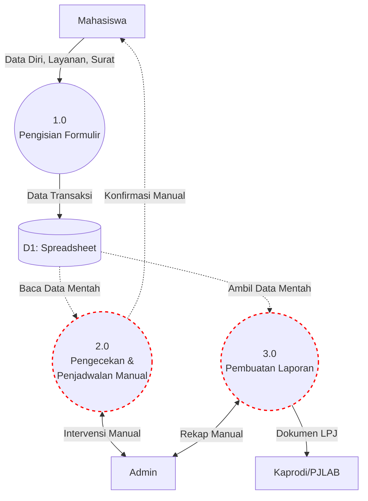

---

## 🟢 SISTEM BARU (LAB_UAI Web Application)

### DFD Level 0 - Context Diagram

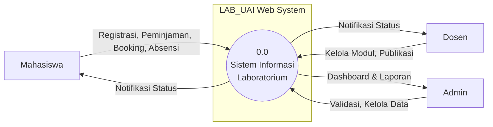

---

### DFD Level 1 - Process Breakdown

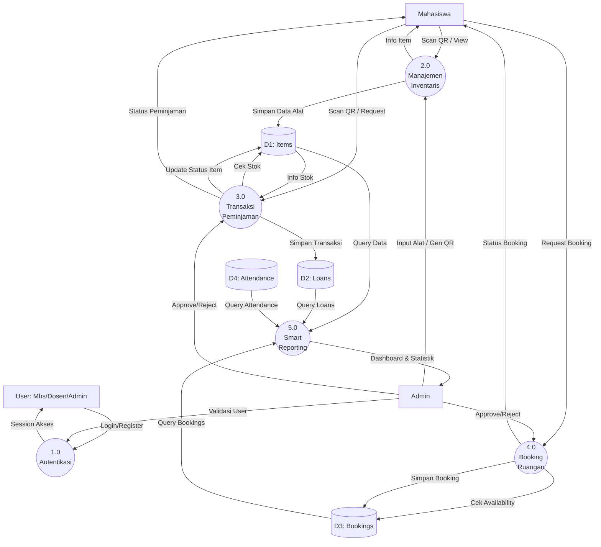

---

### DFD Level 2 - Detail Per Proses

#### 2.1 Authentication (P1)

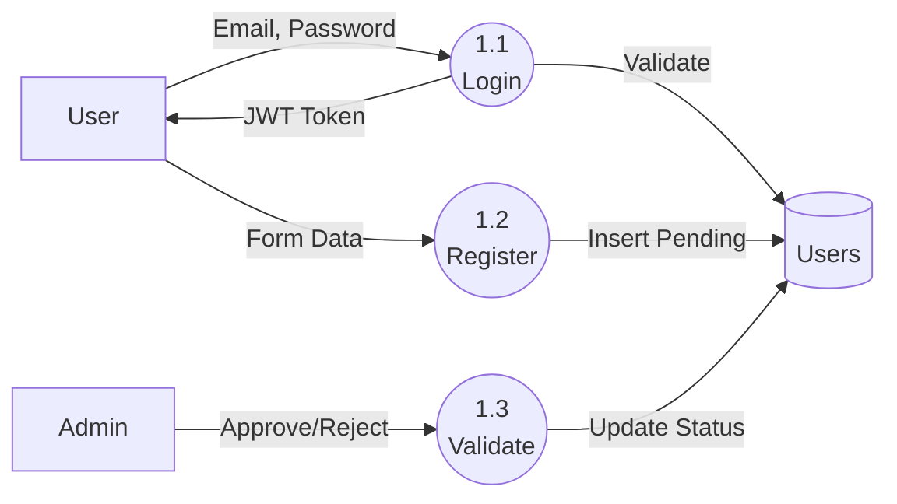

---

#### 2.2 Inventory Management (P2)

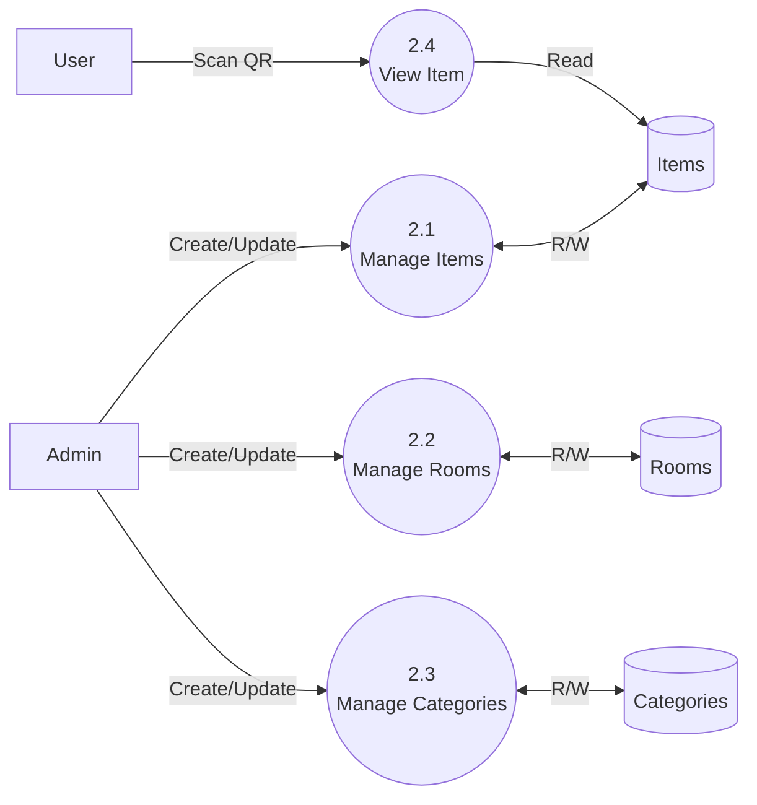

---

#### 2.3 Item Loan (P3)

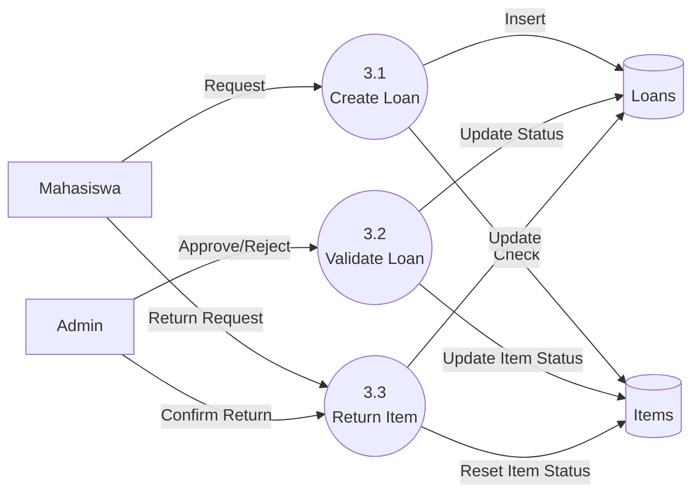

---

#### 2.4 Room Booking (P4)

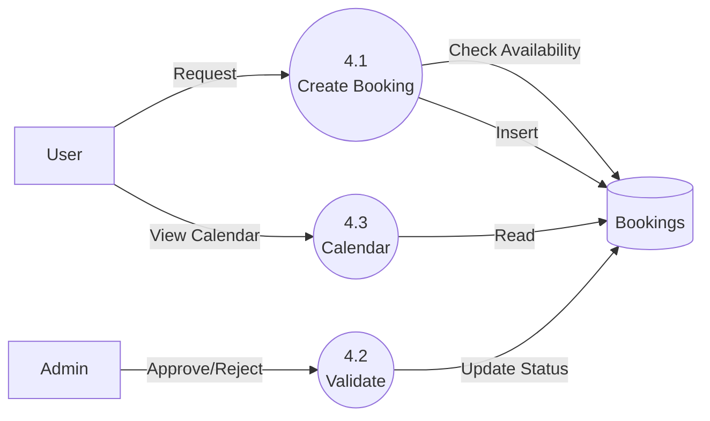

---

#### 2.5 Lab Attendance (P5)

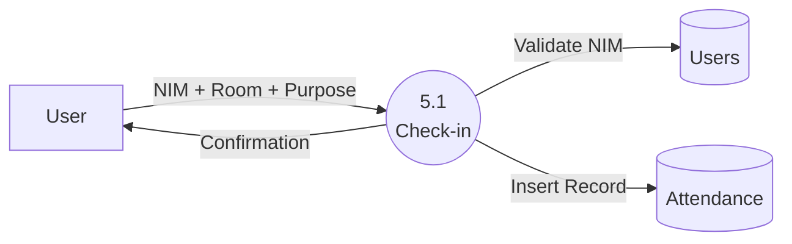

---

#### 2.6 Publications (P6)

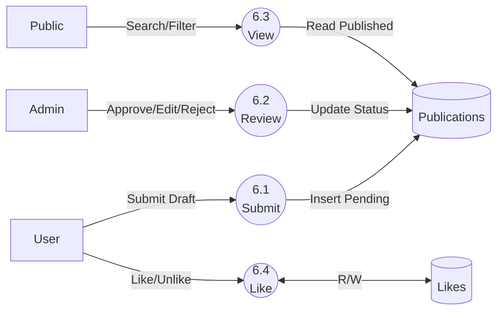

---

#### 2.7 Practicum Modules (P7)

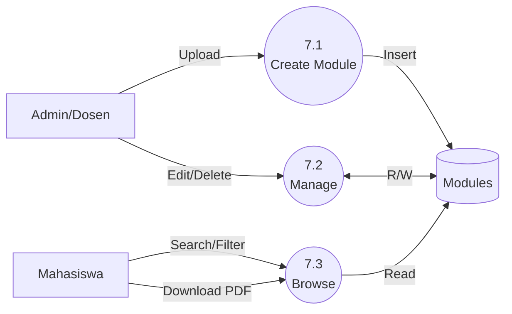

---

#### 2.8 Governance Documents (P8)

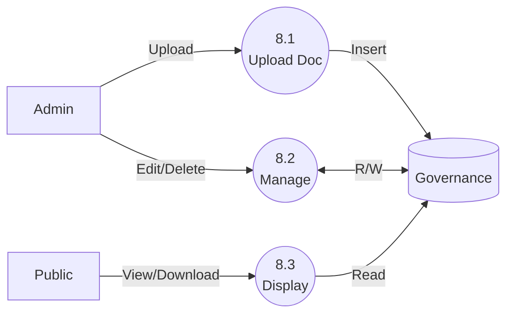

---

## Perbandingan Sistem Lama vs Baru

| Aspek | Sistem Lama | Sistem Baru (LAB_UAI) |
|-------|-------------|----------------------|
| **Penyimpanan** | Spreadsheet | MySQL Database |
| **Akses** | Offline/File Share | Web-based (Online) |
| **Validasi** | Manual Admin | Semi-Auto (dengan surat) |
| **Laporan** | Manual Rekap | Dashboard Otomatis |
| **Notifikasi** | Tidak Ada | Real-time Status |
| **User Roles** | Tidak Ada | Admin, Dosen, Mahasiswa |
| **Peminjaman** | Paper-based | QR Code Scan |
| **Booking** | Manual Check | Calendar + Auto Check |
| **Publikasi** | Tidak Ada | Submit & Review System |
