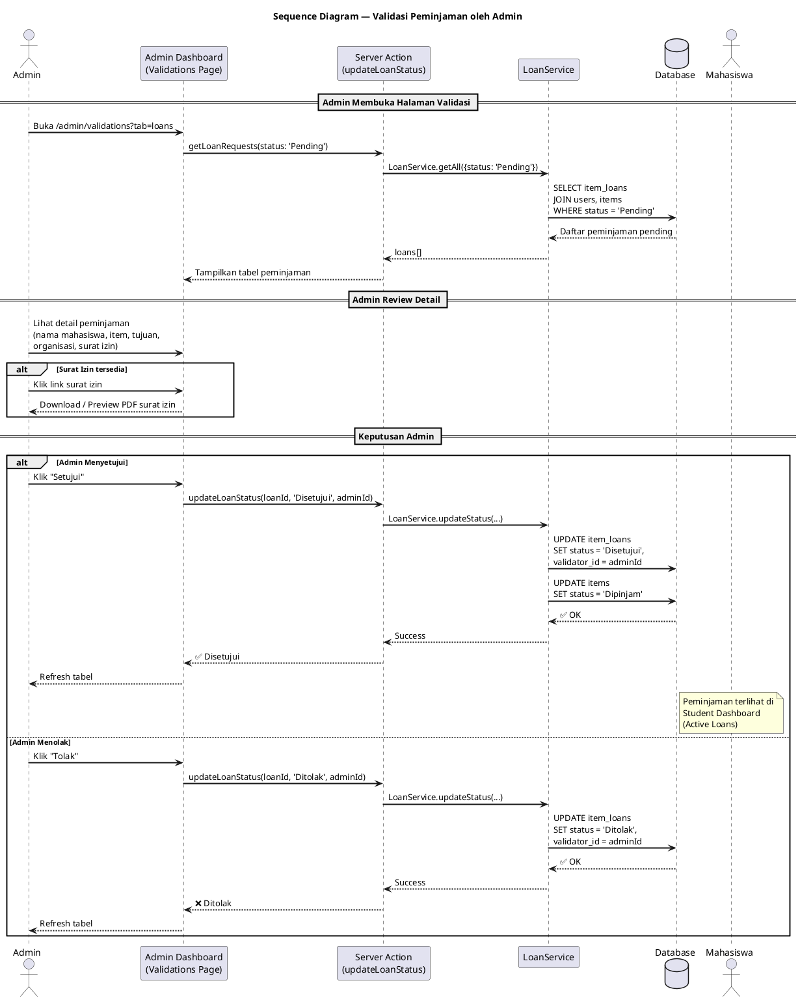
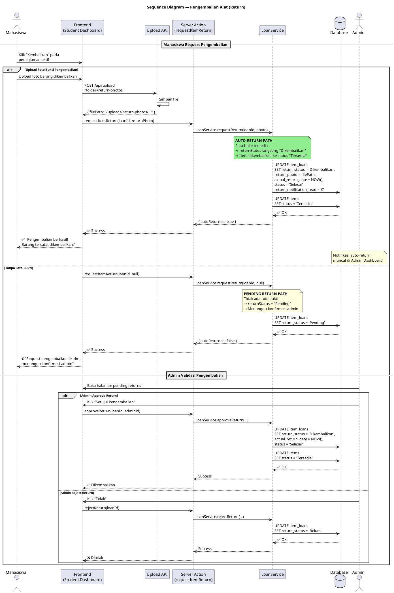
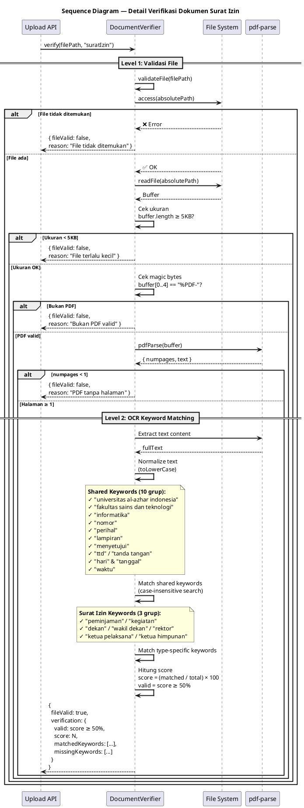

# Sequence Diagram — Fitur Peminjaman Alat (Item Loan)

Dokumentasi sequence diagram menggunakan PlantUML untuk alur peminjaman alat laboratorium, termasuk mekanisme **Auto-Approve** via verifikasi dokumen surat izin.

---

## 1. Sequence Diagram Lengkap — Peminjaman dengan Auto-Approve

Diagram ini mencakup seluruh alur: request, upload surat, verifikasi dokumen, auto-approve, dan fallback ke manual review.

```plantuml
@startuml seq-loan-auto-approve

skinparam sequenceArrowThickness 2
skinparam participantPadding 20
skinparam boxPadding 10

title Sequence Diagram — Peminjaman Alat dengan Auto-Approve

actor "Mahasiswa" as Student
participant "Frontend\n(ItemCard / PinjamPage)" as UI
participant "Upload API\n(/api/upload)" as UploadAPI
participant "DocumentVerifier\n(lib/documentVerifier.ts)" as Verifier
participant "Server Action\n(createLoanRequest)" as Action
participant "LoanService\n(service.ts)" as Service
database "Database\n(MySQL)" as DB
actor "Admin" as Admin

== Mahasiswa Mengisi Form Peminjaman ==

Student -> UI : Scan QR Code / Pilih Item
UI -> UI : Tampilkan form peminjaman\n(organisasi, tujuan, tanggal,\ndosen pembimbing, surat izin)

alt Mahasiswa Upload Surat Izin (PDF)

    == Upload & Verifikasi Dokumen ==

    Student -> UI : Upload file PDF surat izin
    UI -> UploadAPI : POST /api/upload\n?folder=surat-izin&verify=true&type=suratIzin
    
    UploadAPI -> UploadAPI : Validasi tipe file\n(hanya PDF yang diterima)
    
    alt File bukan PDF
        UploadAPI --> UI : ❌ 400 "Hanya file PDF yang diizinkan"
        UI --> Student : Tampilkan error
    else File adalah PDF
        UploadAPI -> UploadAPI : Simpan file ke\n/public/uploads/surat-izin/
        
        UploadAPI -> Verifier : verify(filePath, "suratIzin")
        
        == Level 1: Validasi File ==
        
        Verifier -> Verifier : validateFile(filePath)
        note right of Verifier
            1. Cek file ada (fs.access)
            2. Cek ukuran minimum (>5KB)
            3. Cek magic bytes PDF (%PDF-)
            4. Cek jumlah halaman (≥1)
        end note
        
        alt File tidak valid
            Verifier --> UploadAPI : { fileValid: false, reason: "..." }
            UploadAPI --> UI : ✅ 200\n{ filePath, verification: { valid: false } }
            UI -> UI : Set suratVerified = false
            UI --> Student : ⚠️ "File tidak valid, akan direview manual"
        else File valid
        
            == Level 2: OCR & Keyword Matching ==
            
            Verifier -> Verifier : verifyDocument(filePath, "suratIzin")
            note right of Verifier
                1. Extract text via pdf-parse
                2. Cocokkan shared keywords (10):
                   - UNIVERSITAS AL-AZHAR INDONESIA
                   - FAKULTAS SAINS DAN TEKNOLOGI
                   - Informatika, Nomor, Perihal,
                   - Lampiran, Menyetujui, ttd,
                   - Hari & tanggal, Waktu
                3. Cocokkan type-specific keywords (3):
                   - peminjaman/kegiatan
                   - Dekan/Wakil Dekan/Rektor
                   - Ketua Pelaksana/Ketua Himpunan
                4. Hitung score:
                   score = (matched / total) × 100
                5. valid = score ≥ 50%
            end note
            
            alt Score ≥ 50% (Verified)
                Verifier --> UploadAPI : { valid: true, score: 75,\nmatchedKeywords: [...] }
                UploadAPI --> UI : ✅ 200\n{ filePath, verification: { valid: true, score: 75 } }
                UI -> UI : Set suratVerified = true
                UI --> Student : ✅ "Surat terverifikasi — akan di-auto-approve"
            else Score < 50% (Not Verified)
                Verifier --> UploadAPI : { valid: false, score: 30,\nmissingKeywords: [...] }
                UploadAPI --> UI : ✅ 200\n{ filePath, verification: { valid: false, score: 30 } }
                UI -> UI : Set suratVerified = false
                UI --> Student : ⚠️ "Surat belum memenuhi syarat,\nakan direview manual"
            end
        end
    end

else Tanpa Surat Izin
    UI -> UI : suratIzin = null\nsuratVerified = false
end

== Submit Form Peminjaman ==

Student -> UI : Klik "Ajukan Peminjaman"
UI -> Action : createLoanRequest({\n  itemId, studentId,\n  suratIzin, suratVerified,\n  organisasi, purpose, ... })

Action -> Action : Validasi input\n(sessionCheck, required fields)
Action -> Service : LoanService.create(input)

Service -> DB : SELECT item WHERE id = itemId
DB --> Service : Item data

alt Item tidak tersedia
    Service --> Action : ❌ Error "Item tidak tersedia"
    Action --> UI : Error
    UI --> Student : ❌ "Item sedang dipinjam"
else Item tersedia

    == Logika Auto-Approve ==
    
    alt suratIzin ada DAN suratVerified = true
        note over Service #lightgreen
            **AUTO-APPROVE PATH**
            Surat izin ada dan terverifikasi
            → Status langsung "Disetujui"
        end note
        Service -> DB : INSERT item_loans\n(status: 'Disetujui',\nnotificationRead: '0')
        Service -> DB : UPDATE items\nSET status = 'Dipinjam'\nWHERE id = itemId
        DB --> Service : ✅ OK
        Service --> Action : { loan, autoApproved: true }
        Action --> UI : ✅ Success
        UI --> Student : ✅ "Peminjaman disetujui otomatis!\nSurat izin Anda terverifikasi."
        
        note over Admin
            Notifikasi auto-approve
            muncul di Admin Dashboard
            (DashboardNotifications)
        end note
        
    else suratIzin ada TAPI suratVerified = false
        note over Service #lightyellow
            **PENDING PATH**
            Surat ada tapi verifikasi gagal
            → Status "Pending" untuk review manual
        end note
        Service -> DB : INSERT item_loans\n(status: 'Pending')
        DB --> Service : ✅ OK
        Service --> Action : { loan, autoApproved: false }
        Action --> UI : ✅ Success
        UI --> Student : ⏳ "Pengajuan dikirim,\nmenunggu persetujuan admin"
        
    else Tanpa surat izin
        note over Service #lightyellow
            **PENDING PATH**
            Tidak ada surat izin
            → Status "Pending"
        end note
        Service -> DB : INSERT item_loans\n(status: 'Pending')
        DB --> Service : ✅ OK
        Service --> Action : { loan, autoApproved: false }
        Action --> UI : ✅ Success
        UI --> Student : ⏳ "Pengajuan dikirim,\nmenunggu persetujuan admin"
    end
end

@enduml
```

---

## 2. Sequence Diagram — Validasi Admin (Manual Approval)

Alur ketika admin memvalidasi peminjaman yang berstatus Pending.

---

## 3. Sequence Diagram — Pengembalian Alat (Return Flow)

Alur pengembalian alat, termasuk auto-return dengan foto bukti.

---

## 4. Sequence Diagram — Alur Verifikasi Dokumen (Detail)

Detail internal proses verifikasi dokumen surat izin oleh `DocumentVerifier`.

---

## Ringkasan Alur

| Skenario | Surat Izin | Verifikasi | Status Awal | Approval |
|----------|------------|------------|-------------|----------|
| Auto-Approve | ✅ Ada (PDF) | ✅ Score ≥ 50% | **Disetujui** | Otomatis |
| Manual Review | ✅ Ada (PDF) | ❌ Score < 50% | **Pending** | Admin review |
| Manual Review | ❌ Tidak ada | — | **Pending** | Admin review |

| Skenario Return | Foto Bukti | Status Return | Approval |
|----------------|------------|---------------|----------|
| Auto-Return | ✅ Ada | **Dikembalikan** | Otomatis |
| Manual Return | ❌ Tidak ada | **Pending** | Admin review |

---

## Cara Render

Gunakan salah satu metode di bawah untuk menghasilkan gambar dari kode PlantUML:

1. **Online**: [plantuml.com/plantuml/uml](https://www.plantuml.com/plantuml/uml/)
2. **VS Code**: Extension `jebbs.plantuml` → `Alt+D` untuk preview
3. **CLI**: `java -jar plantuml.jar SEQUENCE_DIAGRAM.md`
