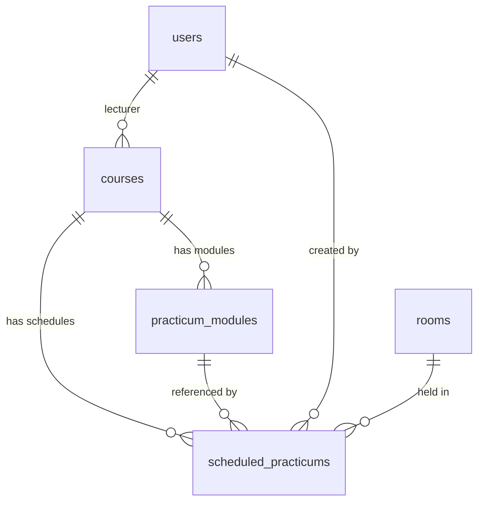
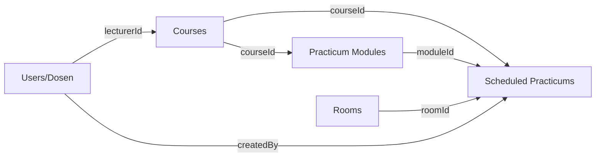

# Praktikum (Courses, Modul & Jadwal)

## Deskripsi

Sistem Praktikum terdiri dari 3 sub-fitur yang saling terkait:

1. **Courses (Mata Kuliah)** — Data master mata kuliah + dosen pengajar
2. **Practicum Modules (Modul Praktikum)** — Repositori materi/modul per mata kuliah
3. **Scheduled Practicums (Jadwal Praktikum)** — Penjadwalan praktikum di kalender akademik



## User Access

| Role | Courses | Modul Praktikum | Jadwal Praktikum |
|------|---------|-----------------|------------------|
| **Admin** | Full CRUD | Full CRUD | Full CRUD |
| **Dosen/Kepala Lab** | Full CRUD | Full CRUD | Full CRUD |
| **Mahasiswa** | Read Only | Read & Download | Read Only |

> [!NOTE]
> Akses write pada Courses dan Jadwal Praktikum dilindungi oleh `requireLabStaff()` (Admin + Kepala Lab).

---

## 1. Courses (Mata Kuliah)

### Data Model — Tabel `courses`

| Kolom | Tipe | Deskripsi |
|-------|------|-----------|
| id | INT (PK, auto) | ID mata kuliah |
| code | VARCHAR(20), UNIQUE | Kode mata kuliah (e.g. "IF201") |
| name | VARCHAR(255) | Nama mata kuliah (e.g. "Basis Data") |
| description | TEXT | Deskripsi (opsional) |
| sks | INT (default: 3) | Jumlah SKS |
| semester | VARCHAR(50) | Semester (e.g. "Ganjil 2024/2025") |
| lecturerId | INT (FK → users) | Dosen pengajar |
| createdAt | DATETIME | Waktu dibuat |

### Service Layer — `features/courses/service.ts`

| Method | Deskripsi |
|--------|-----------|
| `getAll()` | Semua courses + nama dosen (JOIN users) |
| `getById(id)` | Detail course + nama dosen |
| `search(query)` | Cari berdasarkan kode atau nama |
| `create(data)` | Buat mata kuliah baru |
| `update(id, data)` | Update data mata kuliah |
| `assignLecturer(courseId, lecturerId)` | Assign/unassign dosen ke mata kuliah |
| `delete(id)` | Hapus mata kuliah |
| `getAllSemesters()` | Daftar semester unik |

### Server Actions — `features/courses/actions.ts`

| Action | Auth | Deskripsi |
|--------|------|-----------|
| `getCourses()` | — | Ambil semua courses |
| `getCourseById(id)` | — | Detail course |
| `searchCourses(query)` | — | Cari courses |
| `getAllSemesters()` | — | Daftar semester |
| `createCourse(data)` | `requireLabStaff()` | Buat course baru |
| `updateCourse(id, data)` | `requireLabStaff()` | Update course |
| `assignLecturerToCourse(courseId, lecturerId)` | `requireLabStaff()` | Assign dosen |
| `deleteCourse(id)` | `requireLabStaff()` | Hapus course |

### Halaman

| Route | Deskripsi |
|-------|-----------|
| `/admin/courses` | Manajemen mata kuliah (CRUD + assign dosen) |

---

## 2. Practicum Modules (Modul Praktikum)

### Data Model — Tabel `practicum_modules`

| Kolom | Tipe | Deskripsi |
|-------|------|-----------|
| id | INT (PK, auto) | ID modul |
| courseId | INT (FK → courses) | Mata kuliah terkait (opsional) |
| name | VARCHAR(255) | Nama modul (e.g. "Modul 1: Normalisasi") |
| description | TEXT | Deskripsi singkat |
| filePath | VARCHAR(255) | Path file PDF yang diupload |
| createdAt | DATETIME | Waktu upload |
| updatedAt | DATETIME | Waktu update terakhir |

> [!IMPORTANT]
> Field `subjects` (JSON array) telah dihapus dan diganti dengan `courseId` (foreign key ke tabel `courses`). Modul sekarang terhubung langsung ke mata kuliah.

### Service Layer — `features/practicum/service.ts`

| Method | Deskripsi |
|--------|-----------|
| `getAll()` | Semua modul + nama & kode course (JOIN courses) |
| `getById(id)` | Detail modul + info course |
| `search(query)` | Cari berdasarkan nama modul |
| `getByCourseId(courseId)` | Modul per mata kuliah (untuk dropdown) |
| `create(data)` | Upload modul baru |
| `update(id, data)` | Update data modul |
| `delete(id)` | Hapus modul |

### Server Actions — `features/practicum/actions.ts`

| Action | Deskripsi |
|--------|-----------|
| `getModules()` | Ambil semua modul |
| `getModuleById(id)` | Detail modul |
| `searchModules(query)` | Cari modul |
| `getModulesByCourse(courseId)` | Modul per course |
| `createModule(data)` | Upload modul baru |
| `updateModule(id, data)` | Update modul |
| `deleteModule(id)` | Hapus modul |

### Halaman

| Route | Deskripsi |
|-------|-----------|
| `/admin/practicum` | Manajemen modul (Admin) |
| `/lecturer/practicum` | Manajemen modul (Dosen) |
| `/student/practicum` | Katalog & download modul (Mahasiswa) |

---

## 3. Scheduled Practicums (Jadwal Praktikum)

### Data Model — Tabel `scheduled_practicums`

| Kolom | Tipe | Deskripsi |
|-------|------|-----------|
| id | INT (PK, auto) | ID jadwal |
| courseId | INT (FK → courses), NOT NULL | Mata kuliah |
| roomId | INT (FK → rooms), NOT NULL | Ruangan |
| moduleId | INT (FK → practicum_modules) | Modul praktikum (opsional) |
| createdBy | INT (FK → users), NOT NULL | Pembuat jadwal |
| semester | VARCHAR(50), NOT NULL | Semester (e.g. "Ganjil 2024/2025") |
| dayOfWeek | INT, NOT NULL | 0=Senin, 1=Selasa, ..., 6=Minggu |
| startTime | VARCHAR(5), NOT NULL | Jam mulai "HH:MM" |
| endTime | VARCHAR(5), NOT NULL | Jam selesai "HH:MM" |
| scheduledDate | DATETIME, NOT NULL | Tanggal spesifik praktikum |
| status | ENUM('Aktif', 'Dibatalkan') | Status jadwal |
| createdAt | DATETIME | Waktu dibuat |

> [!IMPORTANT]
> Field `weekNumber` dan `topic` telah dihapus. Diganti dengan:
> - `moduleId` — link langsung ke modul praktikum pada mata kuliah
> - `scheduledDate` — tanggal spesifik (wajib/NOT NULL), tidak lagi opsional

### Service Layer — `features/scheduled-practicum/service.ts`

| Method | Deskripsi |
|--------|-----------|
| `getAll(semester?)` | Semua jadwal + course name, room name, module name, creator name |
| `getById(id)` | Detail jadwal lengkap |
| `getByRoom(roomId, semester?)` | Jadwal per ruangan (untuk cek konflik) |
| `hasConflict(roomId, dayOfWeek, startTime, endTime, semester, excludeId?)` | Cek konflik jadwal di ruangan yang sama |
| `create(data, createdBy)` | Buat jadwal baru (auto cek konflik) |
| `update(id, data)` | Update jadwal |
| `delete(id)` | Hapus jadwal |
| `getAllSemesters()` | Daftar semester unik |

### Validasi — `features/scheduled-practicum/validator.ts`

**Create Schema:**
| Field | Validasi |
|-------|----------|
| courseId | Required, min 1 |
| roomId | Required, min 1 |
| moduleId | Optional, min 1 |
| semester | Required, string non-kosong |
| dayOfWeek | Required, 0–6 |
| startTime | Required, format `HH:MM` |
| endTime | Required, format `HH:MM` |
| scheduledDate | Required, coerce to Date |

**Update Schema:** Semua field opsional + tambahan `status` (enum Aktif/Dibatalkan).

### Server Actions — `features/scheduled-practicum/actions.ts`

| Action | Auth | Deskripsi |
|--------|------|-----------|
| `getScheduledPracticums(semester?)` | — | Ambil semua jadwal |
| `getScheduledPracticumById(id)` | — | Detail jadwal |
| `getScheduledPracticumsByRoom(roomId, semester?)` | — | Jadwal per ruangan |
| `getScheduledPracticumSemesters()` | — | Daftar semester |
| `createScheduledPracticum(data)` | `requireLabStaff()` | Buat jadwal baru |
| `updateScheduledPracticum(id, data)` | `requireLabStaff()` | Update jadwal |
| `deleteScheduledPracticum(id)` | `requireLabStaff()` | Hapus jadwal |

### Halaman

| Route | Deskripsi |
|-------|-----------|
| `/admin/scheduled-practicum` | Manajemen jadwal praktikum (Admin) |

---

## UI: Kalender Akademik

Halaman jadwal praktikum menggunakan **tampilan kalender akademik**:

```
┌───────────────────────────────────────────────────────────────┐
│  ◄ Januari 2025 ►                  [Hari Ini]               │
│  Filter: [Semester ▼]                                        │
├───────────────────────────────────────────────────────────────┤
│  Sen  Sel  Rab  Kam  Jum  Sab  Min                          │
│   .    .    .    1    2    3    4                             │
│   5    6   [7]   8    9   10   11     ← hijau = ada jadwal  │
│  12   13   14   [15]  16   17   18    ← klik tanggal        │
│  19   20   21    22   23   24   25      untuk detail         │
│  26   27   28    29   30   31    .                           │
├────────────────────┬──────────────────────────────────────────┤
│  KALENDER           │  DETAIL TANGGAL                         │
│                     │  📅 15 Januari 2025                     │
│                     │  ┌─────────────────────────────────────┐│
│                     │  │ Basis Data  |  Lab Komputer A       ││
│                     │  │ 08:00-10:00 |  Modul 3: Normalisasi││
│                     │  └─────────────────────────────────────┘│
│                     │  [ + Tambah Jadwal di Tanggal Ini ]     │
└────────────────────┴──────────────────────────────────────────┘
```

**Fitur kalender:**
- Tanggal dengan jadwal di-highlight hijau + jumlah jadwal
- Klik tanggal → tampilkan detail di panel kanan
- Tombol "Tambah Jadwal" → modal form, auto-fill tanggal
- Navigasi bulan + tombol "Hari Ini"
- Legend: hijau = ada jadwal
- Filter per semester

**Form Jadwal (Modal):**
- Dropdown mata kuliah
- Dropdown ruangan
- Dropdown modul (filter otomatis berdasarkan mata kuliah yang dipilih)
- Date picker (auto-fill dari kalender)
- Hari, jam mulai & selesai
- Semester

---

## Relasi Antar Sub-Fitur



| Relasi | Deskripsi |
|--------|-----------|
| Course → Modules | Satu course memiliki banyak modul |
| Course → Schedules | Satu course memiliki banyak jadwal praktikum |
| Module → Schedule | Satu jadwal merujuk ke satu modul (opsional) |
| Room → Schedule | Satu ruangan memiliki banyak jadwal (cek konflik) |
| User → Course | Dosen pengajar per mata kuliah |
| User → Schedule | Admin/Kepala Lab sebagai pembuat jadwal |

## Relasi dengan Fitur Lain

| Fitur | Relasi |
|-------|--------|
| **Bookings** | Jadwal praktikum digunakan untuk cek konflik saat booking ruangan |
| **Attendance** | Kehadiran mahasiswa terkait dengan jadwal praktikum |
| **Inventory** | Ruangan yang digunakan terhubung ke inventory rooms |

## Security

- **Read** — Semua role dapat membaca data courses, modul, dan jadwal (tanpa auth khusus)
- **Write** (Courses & Jadwal) — Dilindungi `requireLabStaff()` (Admin + Kepala Lab)
- **Write** (Modul Praktikum) — Terbuka untuk Admin dan Dosen (revalidate 3 path)
- Validasi input menggunakan Zod schema (`createScheduledPracticumSchema`, `updateScheduledPracticumSchema`)
- Konflik jadwal dicek otomatis sebelum create jadwal baru
